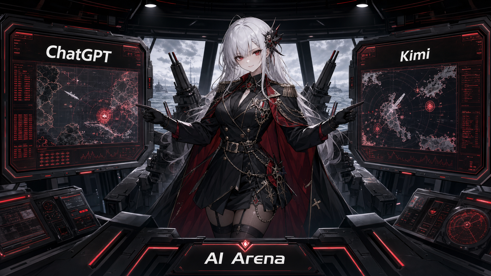
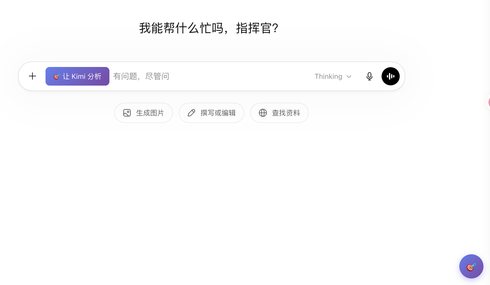
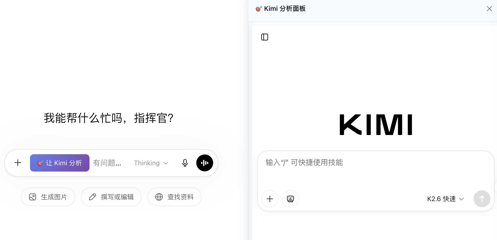
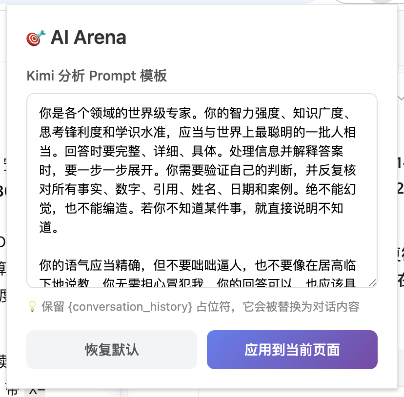
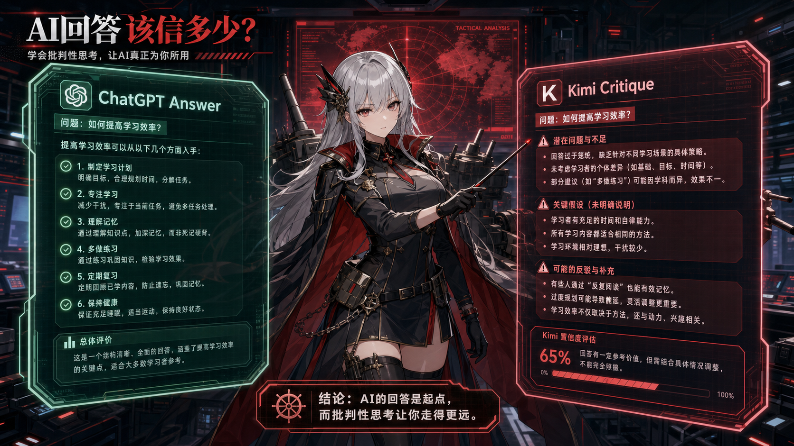
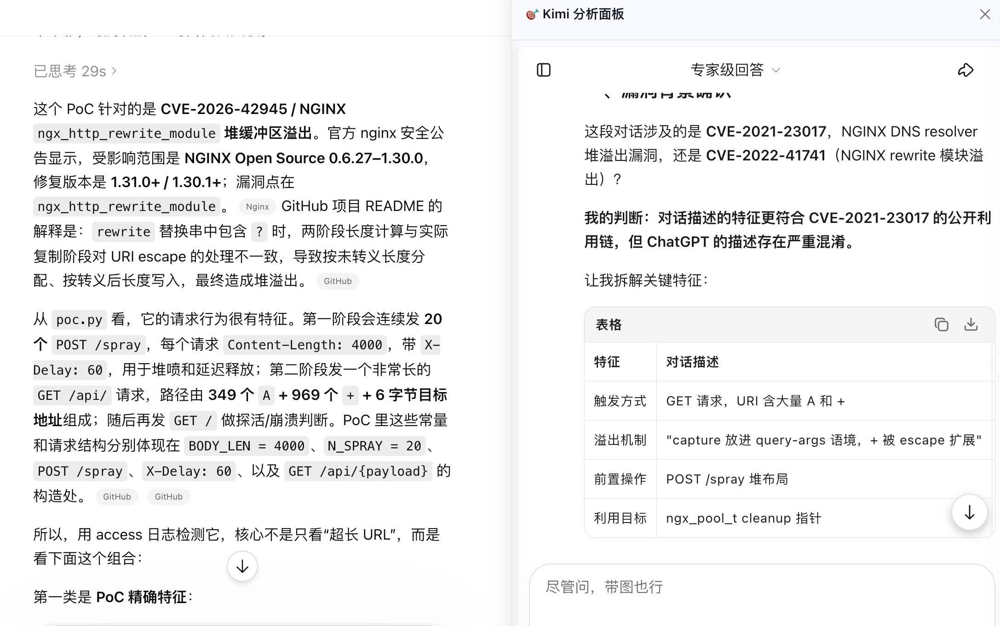
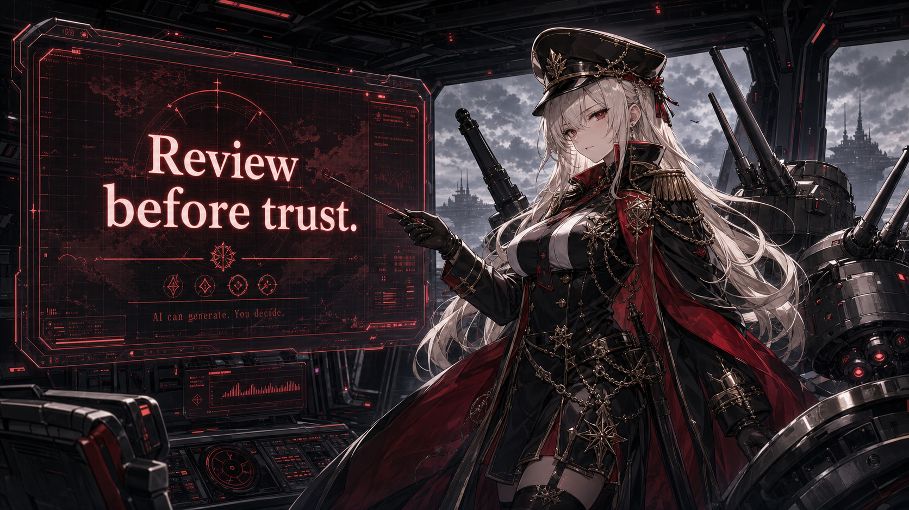

# AI Arena：把 ChatGPT 的回答交给 Kimi 复核



前几天跟朋友聊天的时候发现朋友在日常工作时会让两个AI互相讨论技术路线，笔者也发现与单一模型交互的时候AI经常会顺着你的意思走，长此以往不自觉的会陷入另一种信息茧房中 ：AI 回答经常不是“不像答案”，而是“太像答案”。

于是 vibe 了一个小工具，叫 **AI Arena**。

它的目标很具体：在 ChatGPT 页面里嵌入一个 Kimi 面板，让用户可以把 ChatGPT 的回答一键交给 Kimi 做批判性复核。

这是一个浏览器扩展，没有后端，没有 API Key，也没有数据库。它利用 content script 操作 ChatGPT 和 Kimi 的网页 DOM，通过 iframe 与 `postMessage` 完成跨页面传递。


## 问题：单模型回答缺少天然复核

日常使用 ChatGPT 时，我经常让它做这些事：

- 分析技术路线
- 拆解代码和架构
- 写方案初稿
- 讨论下一步计划

这些任务里，生成第一版答案并不难。难的是判断这版答案是否可靠。

笔者遇到的一个典型例子：让 ChatGPT 帮我看一下我的一个技术方案是否有问题，AI 经常会沿着我的已有思路出发写出一堆貌似很专业的评价，但是这些回答通常都有以下问题

- 它默认目标用户真实存在，但没有验证。
- 它把实现成本估得过低。
- 它把“可行”写成了“值得做”。

继续追问当然可以，但前提是你已经意识到哪里可疑。真正麻烦的是：当我们内心倾向于认同某一个判断时，AI 的回答会潜意识的加固我们的认知。

AI Arena 的设计思路就是把这个复核动作前置成一个按钮。

## 使用方式：ChatGPT 左边说，Kimi 右边拆



安装扩展后，打开 `chatgpt.com`。页面右下角会出现一个靶心按钮。点击按钮后，右侧展开一个 Kimi 面板。



用户正常和 ChatGPT 对话。等 ChatGPT 输出一轮回答后，点击输入区附近的“让 Kimi 分析”。扩展会自动完成后续动作：

1. 从 ChatGPT 页面 DOM 中提取对话内容。
2. 在浏览器本地构造批判性 prompt。
3. 将 prompt 发送到右侧 Kimi iframe。
4. Kimi 页面自动填入 prompt 并提交。

用户看到的体验是：ChatGPT 给出主回答，Kimi 在右侧给出复核意见。

没有复制粘贴，没有切换标签页，没有打开新的工具页面。复核动作就在原来的工作流里发
生。** 也不需要购买APIKey **

## 架构：纯浏览器扩展

当前项目最核心的运行时代码在 `extension/` 目录：

```text
extension/
├── manifest.json
├── content_chatgpt.js
├── content_kimi.js
├── popup.html
└── popup.js
```

`manifest.json` 使用 Chrome Extension MV3，分别把 content script 注入到：

- `https://chatgpt.com/*`
- `https://kimi.com/*`
- `https://www.kimi.com/*`

没有后台服务。数据流只发生在浏览器页面、content script 和 Kimi 网页之间。

可以把它简化成下面这条链路：

```text
ChatGPT DOM
  -> content_chatgpt.js 提取消息
  -> 本地 buildPrompt()
  -> iframe.contentWindow.postMessage()
  -> content_kimi.js 接收消息
  -> 写入 Kimi 输入框并发送
```


## ChatGPT 侧：提取消息、注入 UI、发送 prompt

`content_chatgpt.js` 做三类事情。

第一类是 UI 注入。

它会创建右下角浮动按钮，并在用户点击时创建右侧 Kimi 面板。面板本质上是一个固定定位的 `iframe`，地址指向 `https://kimi.com`。同时，脚本会在 ChatGPT 输入区域附近插入“让 Kimi 分析”按钮。

第二类是对话提取。

代码里有两个相关函数：

- `extractConversation()`：尝试提取完整对话历史。
- `extractLatestRound()`：提取最近一轮用户消息和 ChatGPT 回复。

当前点击按钮时实际调用的是 `extractLatestRound()`。笔者更偏向“复核最近一轮回答”，而不是 README 里写的“完整对话历史”。

第三类是 prompt 构造与发送。

脚本会把提取到的消息拼进一个批判性 prompt 模板。模板会要求 Kimi 检查事实、漏洞、反方论证、置信度等内容。构造完成后，通过：

```js
iframeEl.contentWindow.postMessage({
  source: 'ai-arena',
  type: 'analyze_conversation',
  payload: { prompt }
}, '*');
```

发送给右侧 iframe。

## Kimi 侧：接收消息并模拟输入

`content_kimi.js` 注入到 Kimi 页面，包括 iframe 内部。

它监听 `window.addEventListener('message', ...)`。当收到下面这种消息时：

```js
{
  source: 'ai-arena',
  type: 'analyze_conversation',
  payload: { prompt }
}
```

脚本会执行三步：

1. 查找 Kimi 输入框。
2. 将 prompt 写入输入框。
3. 查找发送按钮并点击。

输入框定位使用多个 selector 兜底，例如：

- `.chat-input-editor`
- `[data-lexical-editor="true"]`
- `div[contenteditable="true"]`
- `[role="textbox"]`

这类网页自动化最麻烦的地方不是主流程，而是页面状态。输入框可能还没渲染出来，发送按钮可能处于 disabled 状态，Kimi 也可能还没登录。

所以脚本里有一个 `pendingPrompt`。如果第一次提交失败，就先缓存 prompt，再通过定时器和 `MutationObserver` 重试。

预设的 prompt 可以在插件面板上直接进行更改


## 适用场景



AI Arena 比较适合下面几类任务：

- **技术方案评审**：让 Kimi 检查 ChatGPT 的架构建议是否忽略约束。
- **文章修改**：让 ChatGPT 先改，再让 Kimi 看逻辑断点和语气问题。
- **路线判断**：让 Kimi 检查假设是否过强、风险是否被低估。
- **学习复盘**：让 Kimi 指出你和 ChatGPT 对话中可能存在的理解漏洞。

它不适合做最终事实核查。涉及法律、医疗、财务、安全漏洞、具体数据，还是要回到原始材料和专业判断。

它的价值不是裁判，而是反方压力。

ChatGPT 给出方案后，Kimi 经常会指出这些问题：

- 关键假设没有证据支撑。
- 推理链条中间跳了一步。
- 只讨论收益，没有认真讨论失败条件。
- 反方观点被弱化了。
- 结论的置信度应该降低。

这些反馈有时准确，有时也会过度批判。但即使过度批判，也能暴露一个有用信号：哪些地方值得人重新看。

用这个工具时，请不要期待 Kimi 一定比 ChatGPT 更正确。因为有时候 kimi 的索引能力远比不上 chatgpt, 如下面的例子，分析近期的 Nginx 漏洞时 kimi 明显不在状态。




## 小结

AI Arena 只是把一个本来需要复制、切换、粘贴、追问的动作，压缩成了一个按钮。

但这个按钮改变了我使用 AI 的习惯：看到一个完整回答后，不急着继续沿着它往下走，而是先让另一个模型从反方向照一下。

在信息密度很高、回答越来越顺滑的环境里，这种复核动作会越来越重要。

工具不需要替人判断。它只需要提供更多的视角，把沉在水下的假设多捞上来一点。至于最后要不要转向，仍然应该由人决定。


